# Part C — Streaming Kafka

Event streaming implementation of the campus food ordering workflow using Apache Kafka.

**Workflow:** User places order → Inventory reserved → Analytics updated

---

## Architecture

```
POST /produce
     │
     ▼
producer_order ──► [orders topic] ──► inventory_consumer ──► [inventory-events topic]
     │                                                                  │
     ▼                                                                  ▼
POST /load-test                                              analytics_consumer
                                                                  │
                                                                  ▼
                                                            GET /metrics
                                                            POST /replay
```

### Services

| Service | Port | Role |
|---|---|---|
| `producer_order` | 8000 | FastAPI — publishes `OrderPlaced` events to `orders` topic |
| `inventory_consumer` | — | Consumes `orders`, publishes `InventoryReserved` / `InventoryFailed` to `inventory-events` |
| `analytics_consumer` | 8002 | Consumes both topics, tracks metrics, exposes `/metrics` and `/replay` |

### Kafka Topics

| Topic | Partitions | Producers | Consumers |
|---|---|---|---|
| `orders` | 3 | `producer_order` | `inventory_consumer`, `analytics_consumer` |
| `inventory-events` | 3 | `inventory_consumer` | `analytics_consumer` |

---

## Implementation Details

### producer_order

- FastAPI server on port 8000
- `POST /produce` — publishes a single `OrderPlaced` event to the `orders` topic
  - Event schema: `{ eventId, eventType, orderId, items, createdAt }`
  - Event key is `orderId` (ensures same order goes to same partition)
- `POST /load-test` — produces N `OrderPlaced` events (default 10,000) and flushes before returning
- Uses `linger.ms=5` and `batch.num.messages=1000` for batched throughput

### inventory_consumer

- Kafka consumer in `inventory-service-group`
- Consumes `OrderPlaced` events from the `orders` topic
- For each order, publishes either `InventoryReserved` or `InventoryFailed` to `inventory-events`
- **Idempotent**: tracks processed order IDs in a `set` — duplicate orders are skipped
- **Fault injection** via environment variables:
  - `INVENTORY_FAIL_RATE` — fraction of orders that fail (e.g. `0.3` = 30%)
  - `CONSUMER_THROTTLE_MS` — artificial delay per message to demonstrate consumer lag

### analytics_consumer

- Kafka consumer in `analytics-group` + FastAPI server on port 8002
- Subscribes to both `orders` and `inventory-events` topics
- Tracks:
  - `total_orders` — count of `OrderPlaced` events
  - `total_reservations` — count of `InventoryReserved` + `InventoryFailed`
  - `failed_reservations` — count of `InventoryFailed`
  - `orders_per_minute` — bucketed by event `createdAt` timestamp
- Writes metrics to stdout and `/app/metrics.txt` every 5 seconds
- `POST /replay` — resets consumer group offsets to 0 and reprocesses all events from the beginning

---

## Setup

### Prerequisites

- Docker and Docker Compose installed
- Add user to docker group if needed:

```bash
sudo usermod -aG docker $USER
newgrp docker
```

### Start all services

```bash
cd streaming-kafka
docker compose up --build
```

This starts: Zookeeper → Kafka → init-kafka (creates topics) → producer_order → inventory_consumer → analytics_consumer

Wait for `init-kafka` to finish creating topics before services become ready.

### Verify services are healthy

```bash
curl -s http://localhost:8000/health | python3 -m json.tool
curl -s http://localhost:8002/health | python3 -m json.tool
```

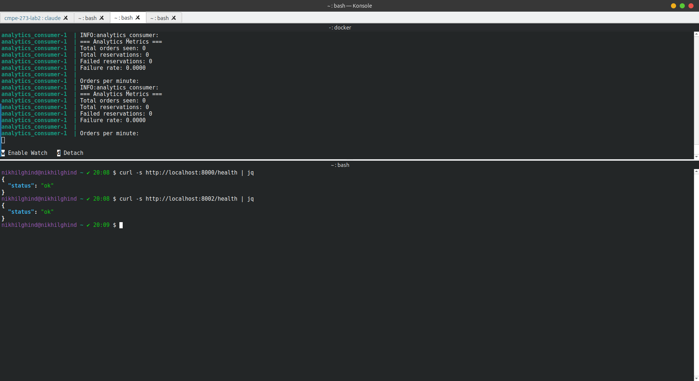

### Teardown

```bash
docker compose down
```

If Kafka fails to start with a `NodeExists` error (stale Zookeeper state), wipe volumes:

```bash
docker compose down -v
docker compose up --build
```

---

## API Reference

### producer_order (port 8000)

**Produce a single order:**
```bash
curl -s -X POST http://localhost:8000/produce \
  -H "Content-Type: application/json" \
  -d '{"orderId": "o-123", "items": [{"sku": "burrito", "qty": 1}]}' | python3 -m json.tool
```

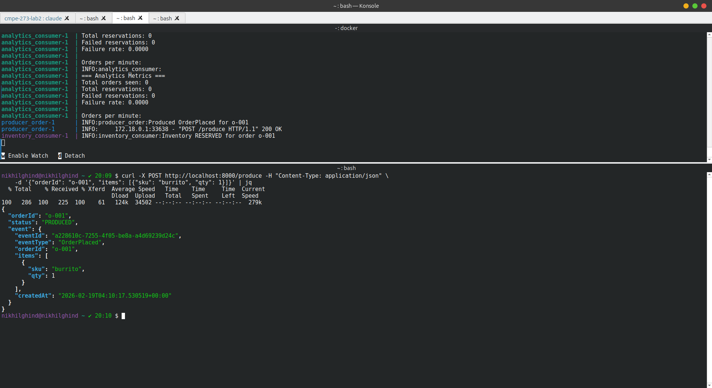

**Load test — produce 100 events:**
```bash
curl -s -X POST http://localhost:8000/load-test \
  -H "Content-Type: application/json" \
  -d '{"count": 100}' | python3 -m json.tool
```


**Load test — produce 10,000 events:**
```bash
curl -s -X POST http://localhost:8000/load-test \
  -H "Content-Type: application/json" \
  -d '{"count": 10000}' | python3 -m json.tool
```

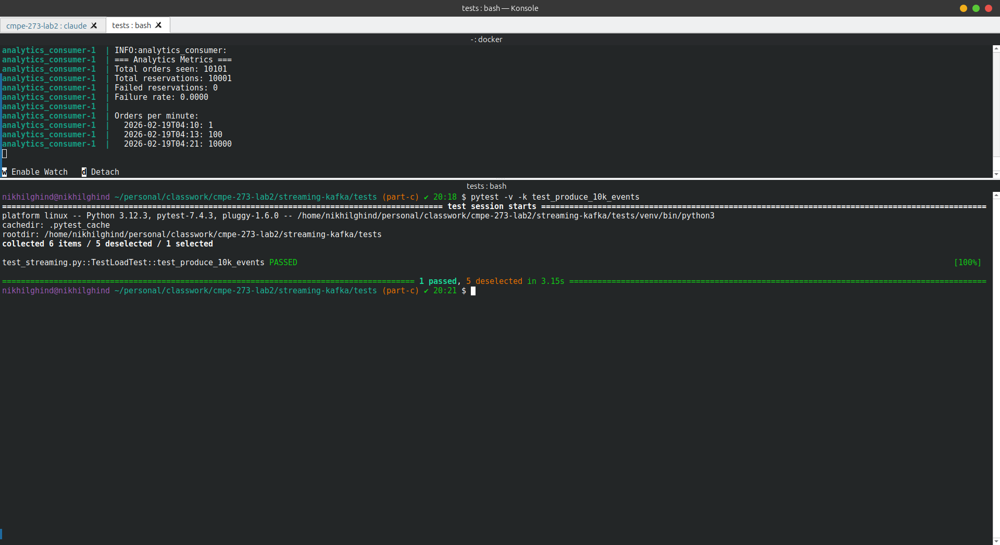

### analytics_consumer (port 8002)

**Get metrics:**
```bash
curl -s http://localhost:8002/metrics | python3 -m json.tool
```

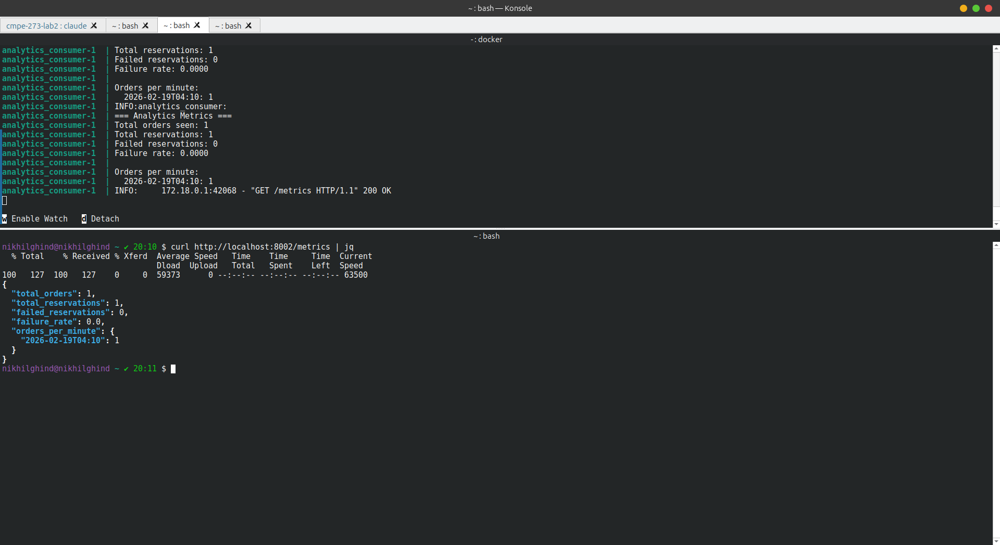

**Trigger replay:**
```bash
curl -s -X POST http://localhost:8002/replay | python3 -m json.tool
```

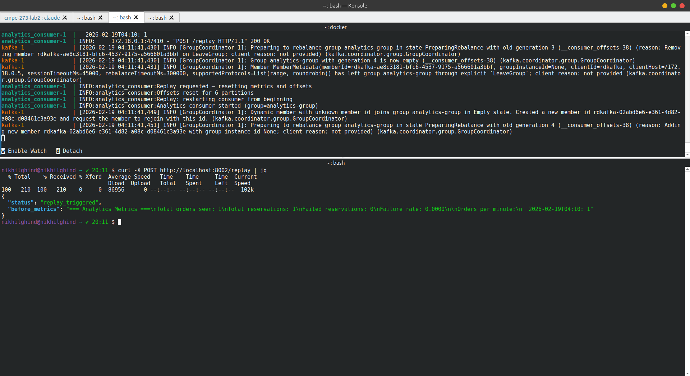

**Metrics after replay:**
```bash
curl -s http://localhost:8002/metrics | python3 -m json.tool
```

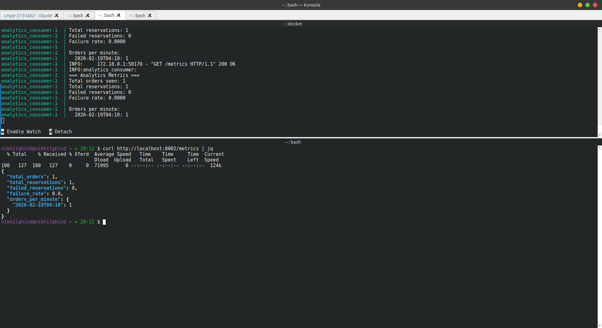

---

## Fault Injection

### Inventory failure rate (30%)

```bash
docker compose down -v
INVENTORY_FAIL_RATE=0.3 docker compose up --build
```

Produce events and check that `failure_rate` is ~0.3 in metrics:

```bash
curl -s -X POST http://localhost:8000/load-test \
  -H "Content-Type: application/json" \
  -d '{"count": 100}' | python3 -m json.tool

sleep 5
curl -s http://localhost:8002/metrics | python3 -m json.tool
```

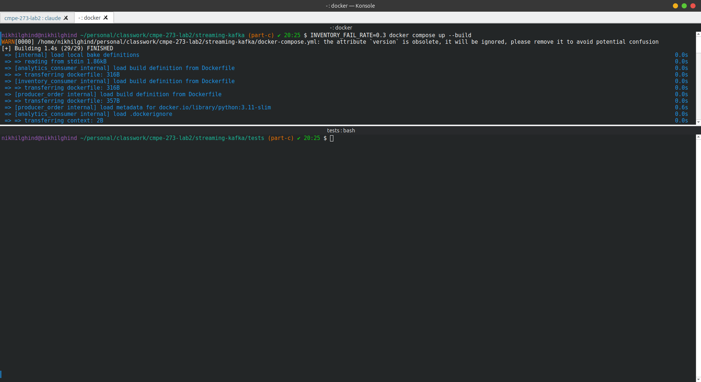

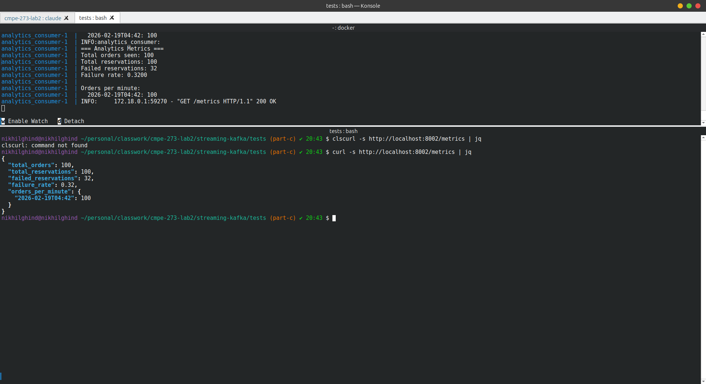

### Consumer lag (throttling)

```bash
docker compose down -v
CONSUMER_THROTTLE_MS=100 docker compose up --build
```

Produce events and observe lag building up:

```bash
curl -s -X POST http://localhost:8000/load-test \
  -H "Content-Type: application/json" \
  -d '{"count": 500}' | python3 -m json.tool
```

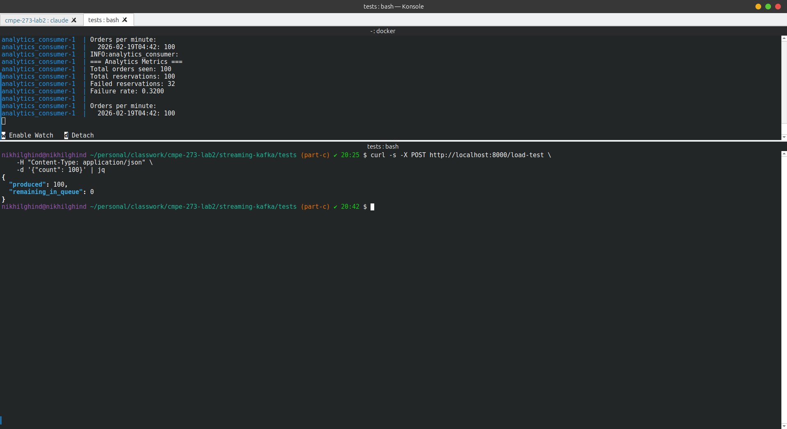

Check consumer lag:

```bash
docker compose exec kafka kafka-consumer-groups \
  --bootstrap-server kafka:29092 \
  --describe --group inventory-service-group
```


---

## Running Tests

### Setup

```bash
cd streaming-kafka/tests
python3 -m venv venv
source venv/bin/activate
pip install -r requirements.txt
```

### Run all tests

> Services must be running via `docker compose up --build` before running tests.

```bash
pytest -v
```

### Run tests one at a time

```bash
pytest -v -k test_produce_10k_events && \
pytest -v -k test_inventory_processes_all && \
pytest -v -k test_analytics_reflects_volume && \
pytest -v -k test_can_query_consumer_groups && \
pytest -v -k test_produce_with_lag_observation && \
pytest -v -k test_replay_metrics
```

---

## Test Cases

### C6 — Load Test (`TestLoadTest`)

Verifies the system can handle high-throughput event production and processing end to end.

**`test_produce_10k_events`**
- Calls `POST /load-test` with `count=10000`
- Asserts response returns `produced=10000` and `remaining_in_queue=0`
- Confirms all messages were flushed to Kafka before the endpoint returned


**`test_inventory_processes_all`**
- Waits up to 120 seconds for `analytics_consumer` to report `total_orders >= 10000`
- Asserts inventory consumer processed all events from the `orders` topic

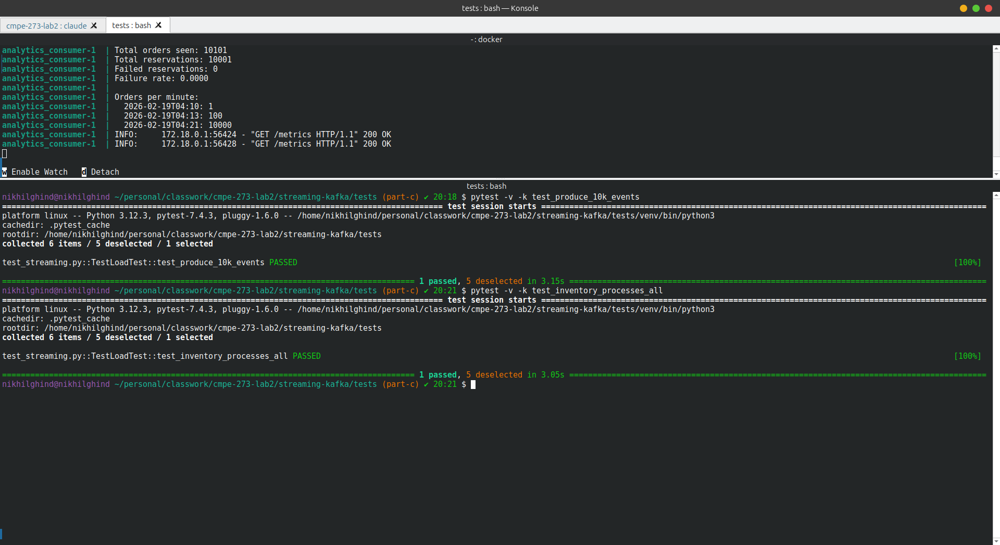

**`test_analytics_reflects_volume`**
- Waits up to 60 seconds for `total_reservations >= 10000`
- Asserts `orders_per_minute` has at least one time bucket entry
- Confirms analytics consumer read and processed all `inventory-events`

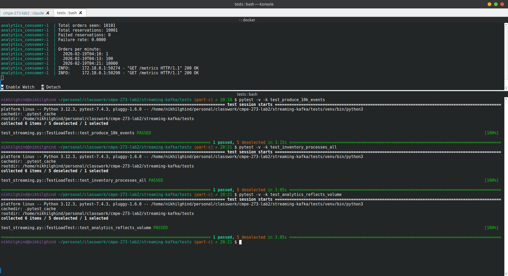

---

### C5 — Consumer Lag Under Throttling (`TestLagUnderThrottling`)

Demonstrates Kafka's ability to track and expose consumer lag when a consumer is slow.

**`test_can_query_consumer_groups`**
- Uses `confluent_kafka.admin.AdminClient` to list all consumer groups
- Asserts `inventory-service-group` is present
- Confirms the inventory consumer registered with Kafka

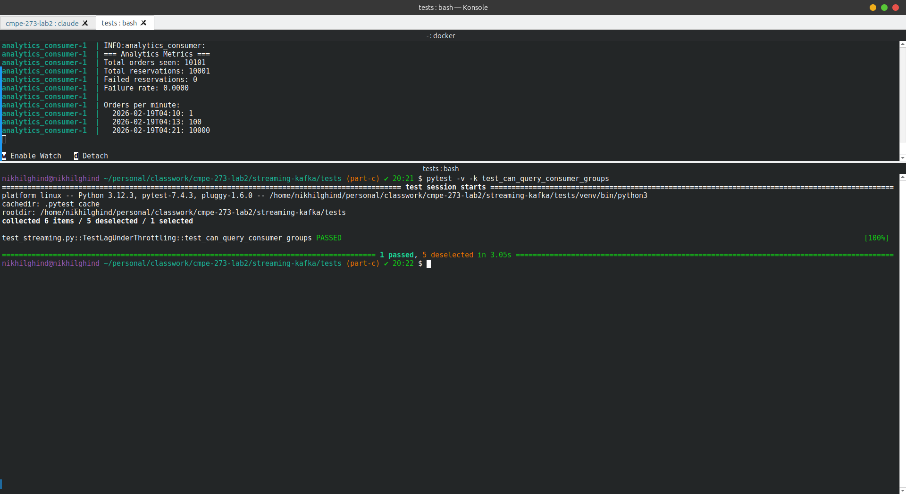

**`test_produce_with_lag_observation`**
- Produces 50 orders via `POST /produce`
- Queries consumer groups via admin client
- Asserts `inventory-service-group` still exists
- To observe actual lag, restart with `CONSUMER_THROTTLE_MS=100`

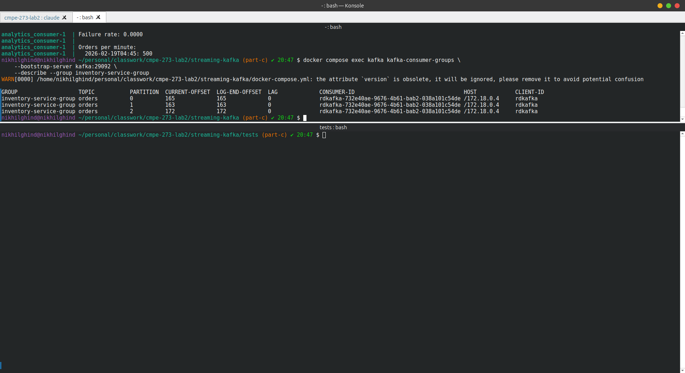

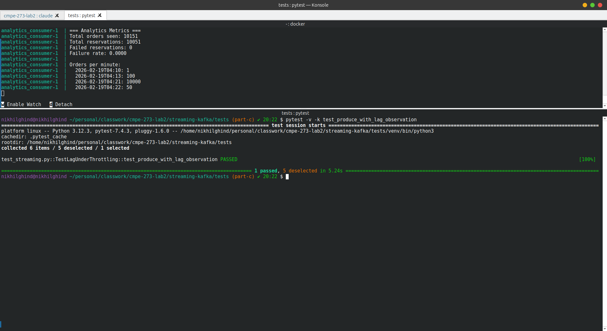

---

### C4 — Replay (`TestReplay`)

Verifies that the analytics consumer can reset its offsets and recompute metrics from scratch.

**`test_replay_metrics`**
- Captures `before` metrics via `GET /metrics`
- Asserts `total_orders > 0` (events exist to replay)
- Calls `POST /replay` to trigger offset reset
- Waits up to 120 seconds for metrics to recover
- Asserts `after.total_orders >= before.total_orders`
- Demonstrates Kafka's event log durability — events are not lost after being consumed

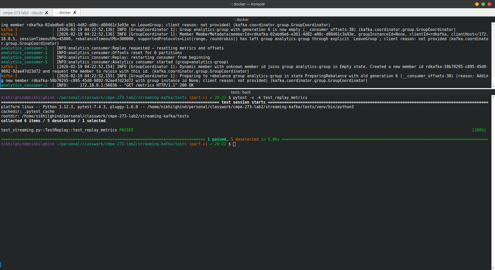
