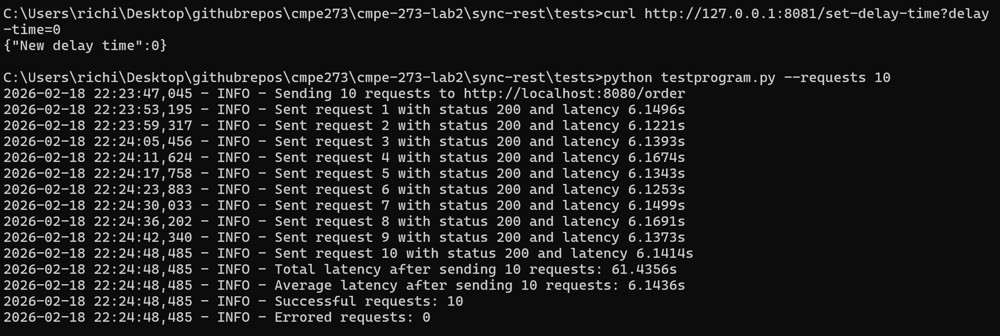
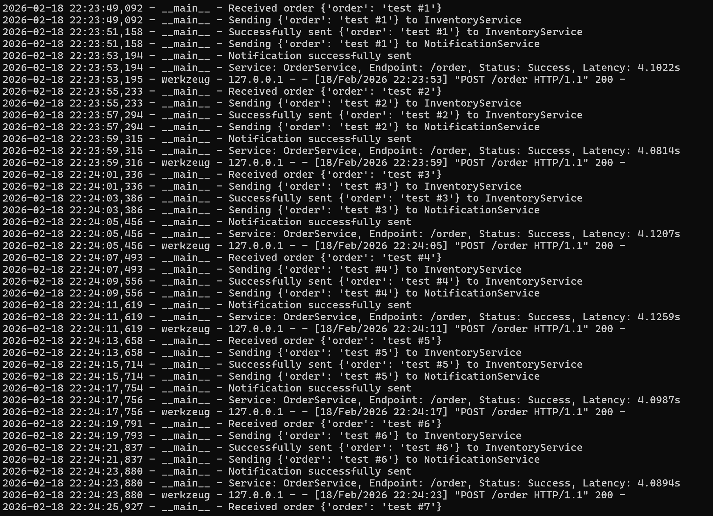
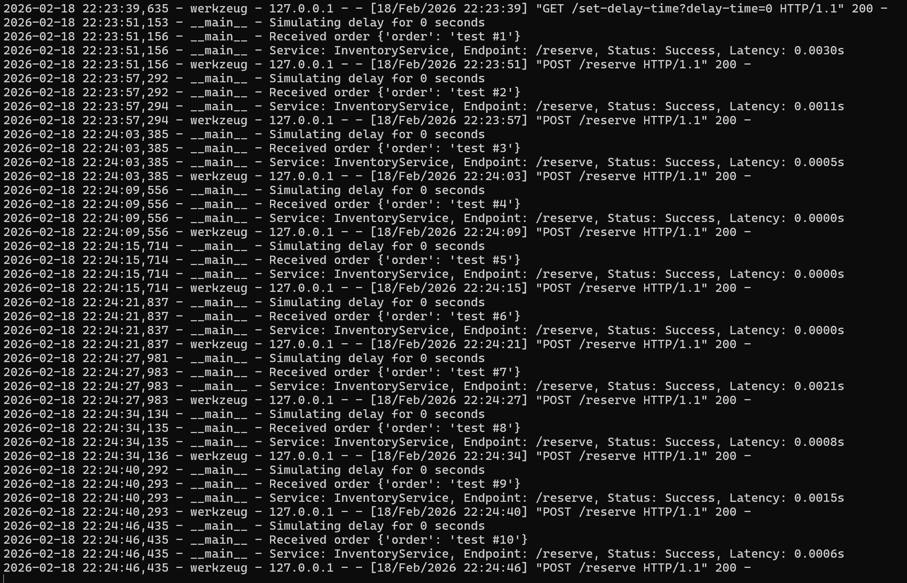
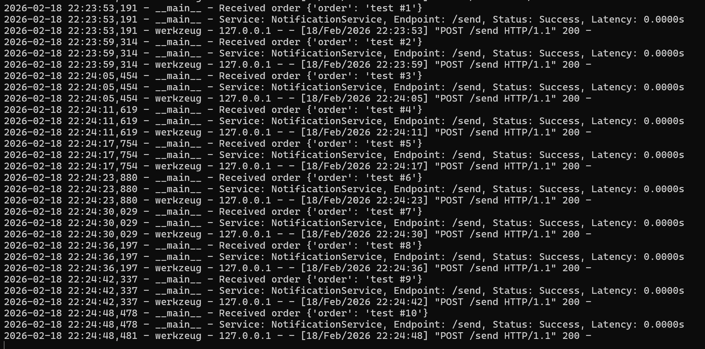
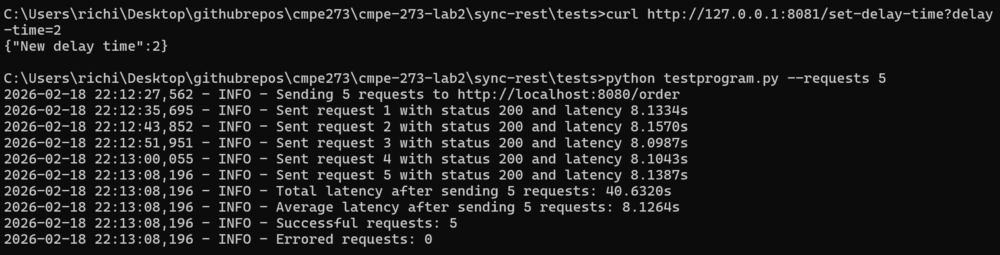
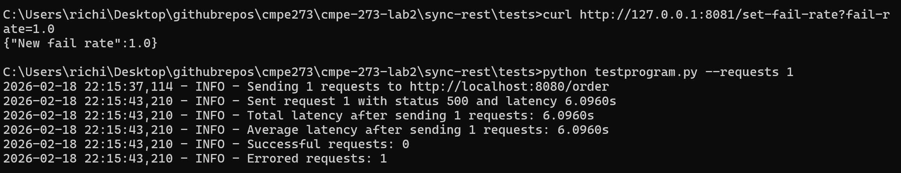
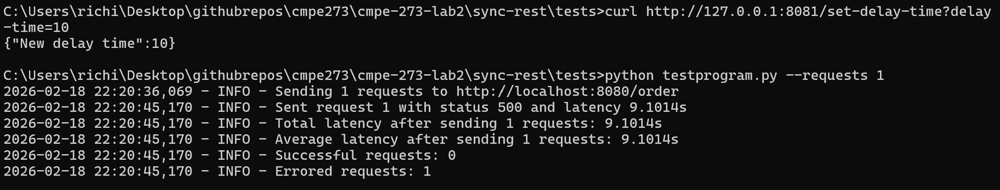
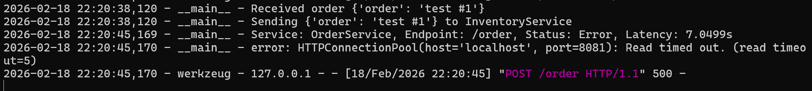

# Part A — Synchronous REST

Synchronous REST implementation of the campus food ordering workflow using Flask.

**Workflow:** User places order → OrderService calls Inventory → OrderService calls Notification → Response returned

---

## Requirements Coverage

| Requirement | Implemented | Where |
|---|---|---|
| `POST /order` on OrderService | ✅ | `order_service/order.py` |
| OrderService calls Inventory synchronously (`POST /reserve`) | ✅ | `order_service/order.py` — `requests.post(..., timeout=5)` |
| If reserve succeeds, calls Notification (`POST /send`) | ✅ | `order_service/order.py` |
| Baseline latency test (N requests) | ✅ | `tests/testprogram.py --requests N` |
| Inject 2s delay into Inventory, measure latency impact | ✅ | `inventory_service/inventory.py --delay-time 2` |
| Inventory failure injection + timeout + error response | ✅ | `GET /set-fail-rate` + 5s timeout on order service |
| Latency table with reasoning | ✅ | See Latency Observations section below |

---

## Architecture

```
Client
  │
  ▼ POST /order
order_service (8080)
  │
  ├──► POST /reserve ──► inventory_service (8081)
  │         │
  │    (success only)
  │
  └──► POST /send ──► notification_service (8082)
  │
  ▼
200 OK / 500 Error
```

All calls are synchronous and blocking — the order service waits for each response before proceeding.

### Services

| Service | Port | Role |
|---|---|---|
| `order_service` | 8080 | Receives orders, calls inventory then notification synchronously |
| `inventory_service` | 8081 | Reserves inventory; supports delay and failure injection |
| `notification_service` | 8082 | Logs order confirmation |

---

## Implementation Details

### order_service

- Flask server on port 8080
- `POST /order` — receives order JSON, calls inventory and notification sequentially
  - Calls `POST /reserve` on inventory with **5 second timeout**
  - If inventory succeeds (200), calls `POST /send` on notification with **5 second timeout**
  - If either call fails or times out, returns `500` with error message
  - Logs latency for each request
- `GET /health` — health check endpoint

### inventory_service

- Flask server on port 8081
- `POST /reserve` — reserves inventory
  - Sleeps for `DELAY_TIME` seconds before processing (default 0)
  - If `FAIL_RATE > 0`, randomly returns `500` at the configured rate
  - Logs latency for each request
- `GET /set-delay-time?delay-time=N` — sets delay at runtime (0–30 seconds)
- `GET /set-fail-rate?fail-rate=F` — sets failure injection rate at runtime (0.0–1.0)
- `GET /health` — health check endpoint
- Startup arg `--delay-time T` — sets initial delay (0–30 seconds)

### notification_service

- Flask server on port 8082
- `POST /send` — logs receipt of order confirmation
- `GET /health` — health check endpoint

---

## Setup

### Run with Docker Compose

```bash
cd sync-rest
docker compose up --build
```

### Run manually (without Docker)

Start each service in a separate terminal:

```bash
# Terminal 1 — Order Service
cd sync-rest/order_service
python order.py

# Terminal 2 — Inventory Service (optional --delay-time arg)
cd sync-rest/inventory_service
python inventory.py --delay-time 0

# Terminal 3 — Notification Service
cd sync-rest/notification_service
python notification.py
```

---

## Testing

### 1. Baseline latency test

Run N requests and measure total and average latency:

```bash
cd sync-rest/tests
python testprogram.py --requests 10
```

**Test output:**



**Order service log:**



**Inventory service log:**



**Notification service log:**



---

### 2. Inject 2s delay into Inventory

**Option 1 — startup arg:**
```bash
python sync-rest/inventory_service/inventory.py --delay-time 2
```

**Option 2 — runtime (while service is running):**
```bash
curl "http://localhost:8081/set-delay-time?delay-time=2"
```

Then run the latency test to observe the impact:
```bash
python sync-rest/tests/testprogram.py --requests 5
```

**Test output:**



Reset after testing:
```bash
curl "http://localhost:8081/set-delay-time?delay-time=0"
```

---

### 3. Inject Inventory failure

Set inventory to fail 100% of the time:
```bash
curl "http://localhost:8081/set-fail-rate?fail-rate=1.0"
```

Place an order:
```bash
curl -s -X POST http://localhost:8080/order \
  -H "Content-Type: application/json" \
  -d '{"order": "test"}' | python3 -m json.tool
```

Expected response:
```json
{
    "error": "inventory failure injected"
}
```

**Test output:**



**Order service log showing error response:**


Reset after testing:
```bash
curl "http://localhost:8081/set-fail-rate?fail-rate=0.0"
```

---

### 4. Simulate timeout

Set inventory delay longer than the order service timeout (5 seconds):
```bash
curl "http://localhost:8081/set-delay-time?delay-time=10"
```

Place an order:
```bash
curl -s -X POST http://localhost:8080/order \
  -H "Content-Type: application/json" \
  -d '{"order": "test"}' | python3 -m json.tool
```

Expected: after ~5 seconds, order service returns `500` with a `ReadTimeout` error.

**Test output:**



**Order service log showing timeout error:**



Reset after testing:
```bash
curl "http://localhost:8081/set-delay-time?delay-time=0"
```

---

## Latency Observations

All tests run with `--requests N` on the test program, services running locally.

| Scenario | Requests | Total Latency | Avg Latency |
|---|---|---|---|
| Baseline (0s delay) | 1 | 6.1494s | 6.1494s |
| Baseline (0s delay) | 5 | 30.5529s | 6.1106s |
| Baseline (0s delay) | 10 | 61.0660s | 6.1066s |
| 2s inventory delay | 1 | 8.1079s | 8.1079s |
| 2s inventory delay | 5 | 40.6167s | 8.1233s |
| 2s inventory delay | 10 | 80.9850s | 8.0985s |

### Analysis

**Why does a 2s inventory delay add exactly ~2s per request?**

Because the system is fully synchronous. The order service blocks on `POST /reserve` until inventory responds. Every request in the test is sent sequentially — request N+1 does not start until request N completes. So the 2s delay compounds linearly:

- Total latency increase = N × 2s (where N = number of requests)
- Average latency increase = 2s per request regardless of N

This is the core vulnerability of synchronous systems: **a slow downstream service directly degrades end-to-end latency for every caller**. In an async system (Part B), the order service would return immediately and the delay would only affect the consumer processing time, not the caller.

**Timeout behavior:**

Without a timeout, a hung inventory service would block the order service indefinitely, consuming a thread/connection for the full duration. The 5s timeout ensures the order service fails fast and returns a meaningful error to the caller rather than hanging.

**Failure handling:**

When inventory returns a non-200 response, `responseInventory.raise_for_status()` raises an `HTTPError`, caught by the outer `except` block, which returns a `500` with the error message. Notification is never called when inventory fails — the chain is broken at the first failure.
